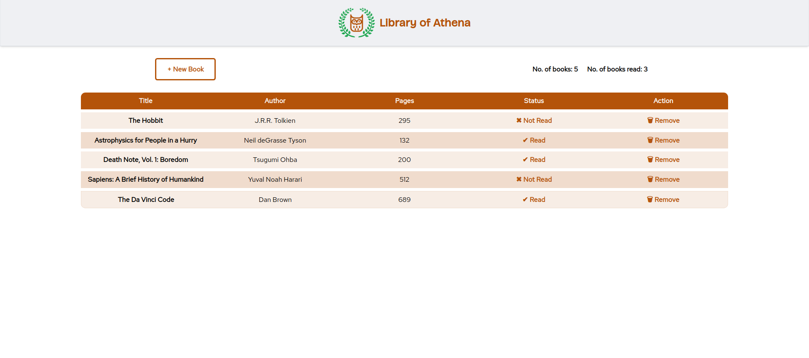

# Library

This is Library of Athena, a web application with the ability to record books that you read, and books you plan to read, implemented using HTML, CSS and JavaScript.

**Check it out :point_right:[here](https://mell62.github.io/library):point_left:!**

## :thumbsup: Features

- A modal form that pops up to input details of a new book for the library, upon clicking "New Book" button
- Client side form validation is implemented to ensure valid inputs
- Ability to change the read status of book by clicking under the "Status" column in the library table
- Ability to remove a book from the library by clicking under the "Action" column in the library table
- A display indicating the total number of books and number of books read in the library

## :star2: Achievements

- The power of JavaScript **Object Constructor** and **Object** is harnessed to initialize the books and display them
- **Object Prototype** is used to change the read status of any book anytime
- Usage of HTML `<dialog>` tag to implement a modal for the new book input form

## :grey_exclamation: Limitations

- Local/cloud storage not implemented which could store a user's library data

## :page_with_curl: Note

- The CSS framework **Tailwind CSS** is used to style almost everything
